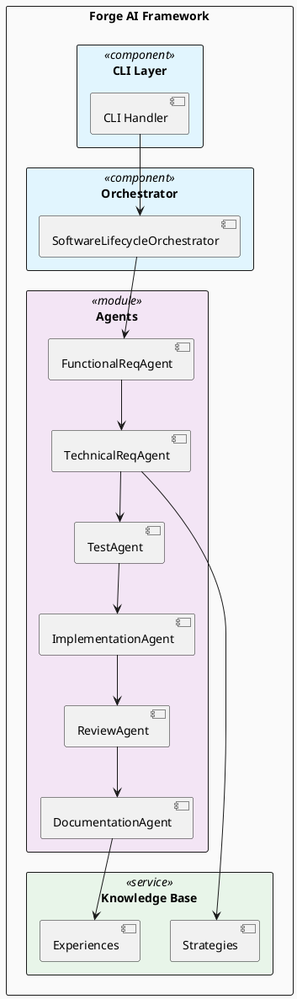
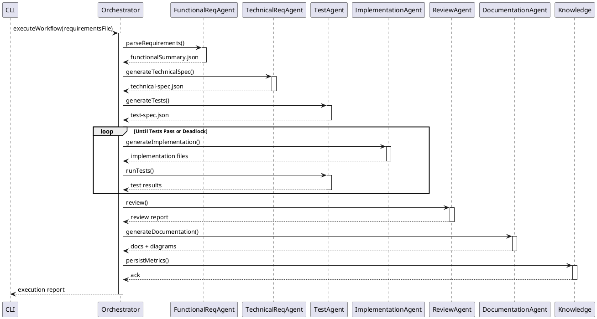

# Forge AI - Execution Report

**Generated:** 2025-12-12T21:02:13.966Z  
**Status:** ✅ SUCCESS

---

## Execution Summary

| Property | Value |
|----------|-------|
| Start Time | 2025-12-12T21:02:13.763Z |
| End Time | 2025-12-12T21:02:13.914Z |
| Duration | 0.15s |
| Total Phases | 8 |
| Errors | 0 |
| Success | Yes |

## Input

**Requirement File:** `N/A`

## Execution Phases

| Phase | Status | Duration | Artifacts |
|-------|--------|----------|-----------|
| ParseRequirements | ✅ completed | - | - |
| FunctionalRequirements | ✅ completed | - | [functional-summary.json](/workspaces/forge-ai/forge-ai-work/functional-summary.json) |
| TechnicalRequirements | ✅ completed | - | [technical-specification.json](/workspaces/forge-ai/forge-ai-work/technical-specification.json) |
| ArchitectureDesign | ✅ completed | - | - |
| TestGeneration | ✅ completed | - | [test-specification.json](/workspaces/forge-ai/forge-ai-work/test-specification.json) |
| Implementation | ✅ completed | - | - |
| CodeReview | ✅ completed | - | - |
| Documentation | ✅ completed | - | - |

### Phase Details

#### ParseRequirements
**Status:** completed  
**Timestamp:** 2025-12-12T21:02:13.773Z  

#### FunctionalRequirements
**Status:** completed  
**Timestamp:** 2025-12-12T21:02:13.821Z  
**Artifact:** `/workspaces/forge-ai/forge-ai-work/functional-summary.json`  

#### TechnicalRequirements
**Status:** completed  
**Timestamp:** 2025-12-12T21:02:13.861Z  
**Artifact:** `/workspaces/forge-ai/forge-ai-work/technical-specification.json`  
**Markdown Spec:** `/workspaces/forge-ai/forge-ai-work/technical-specification.md`  

#### ArchitectureDesign
**Status:** completed  
**Timestamp:** 2025-12-12T21:02:13.862Z  

#### TestGeneration
**Status:** completed  
**Timestamp:** 2025-12-12T21:02:13.880Z  
**Artifact:** `/workspaces/forge-ai/forge-ai-work/test-specification.json`  

#### Implementation
**Status:** completed  
**Timestamp:** 2025-12-12T21:02:13.892Z  

#### CodeReview
**Status:** completed  
**Timestamp:** 2025-12-12T21:02:13.893Z  

#### Documentation
**Status:** completed  
**Timestamp:** 2025-12-12T21:02:13.899Z  

## Generated Artifacts

| File | Type | Path |
|------|------|------|
| functional-summary.json | JSON | `/workspaces/forge-ai/forge-ai-work/functional-summary.json` |
| technical-specification.json | JSON | `/workspaces/forge-ai/forge-ai-work/technical-specification.json` |
| technical-specification.md | MD | `/workspaces/forge-ai/forge-ai-work/technical-specification.md` |
| test-specification.json | JSON | `/workspaces/forge-ai/forge-ai-work/test-specification.json` |

## Metrics & Quality

| Metric | Value | Status |
|--------|-------|--------|
| Tests Passed | N/A | ⏳ (>0) |
| Tests Failed | N/A | ⏳ (= 0) |
| Coverage | N/A | ⏳ (>80%) |
| Lint Errors | N/A | ⏳ (= 0) |
| Iterations to Success | N/A | ⏳ (<5) |

## Issues & Errors

✅ No errors encountered.

## Architecture & Design Diagrams

### Component Diagram



### Execution Flow Sequence



---

## Data (JSON)

```json
{
  "timestamp": "2025-12-12T21-02-13",
  "executionLog": {
    "startTime": "2025-12-12T21:02:13.763Z",
    "phases": [
      {
        "name": "ParseRequirements",
        "status": "completed",
        "timestamp": "2025-12-12T21:02:13.773Z"
      },
      {
        "name": "FunctionalRequirements",
        "status": "completed",
        "artifactPath": "/workspaces/forge-ai/forge-ai-work/functional-summary.json",
        "timestamp": "2025-12-12T21:02:13.821Z"
      },
      {
        "name": "TechnicalRequirements",
        "status": "completed",
        "artifactPath": "/workspaces/forge-ai/forge-ai-work/technical-specification.json",
        "markdownPath": "/workspaces/forge-ai/forge-ai-work/technical-specification.md",
        "timestamp": "2025-12-12T21:02:13.861Z"
      },
      {
        "name": "ArchitectureDesign",
        "status": "completed",
        "timestamp": "2025-12-12T21:02:13.862Z"
      },
      {
        "name": "TestGeneration",
        "status": "completed",
        "artifactPath": "/workspaces/forge-ai/forge-ai-work/test-specification.json",
        "timestamp": "2025-12-12T21:02:13.880Z"
      },
      {
        "name": "Implementation",
        "status": "completed",
        "generatedFiles": 6,
        "timestamp": "2025-12-12T21:02:13.892Z"
      },
      {
        "name": "CodeReview",
        "status": "completed",
        "timestamp": "2025-12-12T21:02:13.893Z"
      },
      {
        "name": "Documentation",
        "status": "completed",
        "artifacts": {
          "featureDoc": "/workspaces/forge-ai/forge-ai-work/feature-documentation.md",
          "architecture": "/workspaces/forge-ai/forge-ai-work/architecture.puml",
          "sequence": "/workspaces/forge-ai/forge-ai-work/sequence.puml",
          "usecases": "/workspaces/forge-ai/forge-ai-work/usecases.puml"
        },
        "timestamp": "2025-12-12T21:02:13.899Z"
      }
    ],
    "metrics": {},
    "errors": [],
    "endTime": "2025-12-12T21:02:13.914Z"
  },
  "reportGeneratedAt": "2025-12-12T21:02:13.979Z"
}
```

---

**Report Generated by Forge AI Report Generator**  
For questions or manual curation, contact your team.
